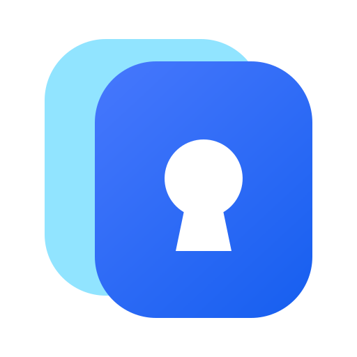

<div align="center">
  

  # LoginDeck

  **把网站与桌面应用账号整理在一个本地、安全、清晰的界面中。**

  LoginDeck 是一款面向 macOS 与 Windows 的开源本地账号密码管理工具。
  密码保存在操作系统凭据库中，账号资料保存在本机，不依赖云端服务。

  [](https://github.com/02Ayanami/Logindeck/releases/latest)
  [](https://github.com/02Ayanami/Logindeck/actions/workflows/macos.yml)
  [](https://github.com/02Ayanami/Logindeck/actions/workflows/windows.yml)
  [](LICENSE)

  [下载 Windows 版](https://github.com/02Ayanami/Logindeck/releases/latest) · [下载 macOS 版](https://github.com/02Ayanami/Logindeck/releases/latest) · [查看使用说明](docs/help/edge-login-zh-CN.md)
</div>

## LoginDeck 能做什么

- **集中管理账号**：在统一界面中管理网站和桌面应用账号，支持新增、编辑、删除与分组展示。
- **使用系统凭据库**：密码分别保存在 macOS 登录钥匙串或 Windows Credential Manager；本地 SQLite 只保存账号元数据。
- **快速复制与打开**：复制账号或密码、打开网站，也可以唤醒已导入的桌面应用。
- **发现本机应用**：自动扫描可启动应用，也支持手动导入 Windows `.exe`。
- **识别 Edge 登录**：配套扩展可在网页提交登录信息时询问是否保存，由用户确认后新增账号或更新密码。
- **保护剪贴板内容**：LoginDeck 写入的密码会在 30 秒后尝试清理；用户随后复制的其他内容不会被覆盖。

## 下载与安装

前往 [GitHub Releases](https://github.com/02Ayanami/Logindeck/releases/latest) 下载最新版：

| 平台 | 支持范围 | 安装包 |
| --- | --- | --- |
| Windows | Windows 10 22H2 / Windows 11，x64 | `LoginDeck-*-windows-x64-setup.exe` |
| macOS | Apple Silicon（M 系列） | `LoginDeck-*-macos-arm64.dmg` |

当前公开安装包**未签名**，因此 Windows SmartScreen 或 macOS Gatekeeper 可能显示安全提醒。下载前请确认发布页同时包含两个平台的安装包与 `SHA256SUMS.txt`，并按需核对文件校验值。本项目暂不提供 Intel macOS 构建。

## 快速开始

1. 安装并打开 LoginDeck。
2. 在“网站”页面添加网站及账号，或在“应用”页面扫描、导入本机应用。
3. 使用账号卡片复制用户名或密码；网站可以直接打开，应用可以直接启动。
4. 如需识别 Edge 登录，在“设置 → Edge 登录识别”中按引导安装扩展。

账号名称是本地备注。未填写时，LoginDeck 会按所在网站或应用生成“账号 N”。每组默认展示三个账号，可以展开查看其余账号。

## Edge 登录识别

LoginDeck 会自动准备扩展文件和本机连接组件，但出于浏览器安全限制，首次使用仍需手动加载扩展：

1. 在 LoginDeck 中打开“设置 → Edge 登录识别”。
2. 打开 Edge 扩展管理页，并开启“开发人员模式”。
3. 点击“加载解压缩的扩展”，选择 LoginDeck 显示的扩展文件夹。
4. 从 Edge 工具栏打开 LoginDeck 扩展，保持桌面应用运行，然后点击“检测连接”。

Windows 扩展目录通常为 `%APPDATA%\com.autologin.desktop\edge-extension`；macOS 请以软件界面显示的路径为准。扩展更新后，需要在 Edge 中重新加载，并刷新已经打开的登录页面。

[中文详细说明](docs/help/edge-login-zh-CN.md) · [English guide](docs/help/edge-login-en.md)

## 当前范围

LoginDeck 当前提供的是本地账号整理、密码保存、复制以及网站或应用启动能力。以下功能尚未提供：

- 自动填写或桌面应用自动登录
- 多账号自动切换
- 短信登录或验证码处理
- 操作录制器
- 批量删除
- Edge 扩展商店自动安装

Windows 应用扫描会合并 Win32 卸载注册信息与当前用户的 MSIX/UWP 可启动应用。启动前会复核文件或包注册元数据，但这些信息不等同于 Authenticode 签名、发布者信任或文件内容认证。

## 数据与安全

| 数据 | macOS | Windows |
| --- | --- | --- |
| 密码 | 登录钥匙串 | Credential Manager |
| 账号元数据 | 本地 SQLite | 本地 SQLite |
| 云端同步 | 不提供 | 不提供 |

- 编辑账号时将密码留空，会保留原密码。
- 系统凭据库与 SQLite 是两个独立存储系统；LoginDeck 使用持久化恢复记录处理操作中断。
- 密码删除失败时会保留账号元数据，并在启动或后续修改时重试恢复。
- 剪贴板自动清理无法控制强制退出后的状态，也无法清除第三方剪贴板历史。
- 涉及安全或敏感数据的问题，请不要创建公开 Issue，改按[安全策略](SECURITY.md)报告。

## 开发

### 技术与仓库结构

LoginDeck 使用 Tauri、Rust、React 和 TypeScript。仓库采用共享核心加平台实现的结构：

- `app/`：桌面界面与 Tauri 应用
- `crates/autologin-core/`：平台无关的核心逻辑
- `crates/platform-macos/`、`crates/platform-windows/`：平台能力实现
- `crates/platform-runtime/`：按编译目标选择平台实现
- `browser-extension/`：Edge 扩展

更多信息参见[仓库架构说明](docs/repository-architecture.md)。`app/preview.html` 使用模拟数据和模拟本机命令，不会读取真实账号。

### 环境要求

- Rust 1.89.0
- Node.js 22
- pnpm 11.19.0
- macOS：Xcode Command Line Tools
- Windows：Visual Studio 2022 Build Tools、Windows SDK、WebView2 Runtime，以及 Rust `x86_64-pc-windows-msvc` 工具链

### 本地运行

```sh
cd app
pnpm install --frozen-lockfile
pnpm desktop
```

版本以 `app/package.json` 为唯一来源；`pnpm sync-version` 会同步 Tauri 配置、桌面 Cargo 包和锁文件。常用命令包括 `pnpm typecheck`、`pnpm test`、`pnpm build` 和 `pnpm tauri build`。

### 完整验证

macOS：

```sh
./scripts/verify-macos.sh
```

Windows（64 位 PowerShell 5.1 或更新版本）：

```powershell
powershell -NoProfile -ExecutionPolicy Bypass -File .\scripts\verify-windows.ps1
```

验证脚本覆盖 Rust 格式与测试、前端依赖安装、类型检查、测试、生产构建、Edge 资源准备，以及完整 Tauri debug 安装包构建。Windows 原生测试需要当前用户桌面会话，并会使用测试专属凭据、注册表项和受控剪贴板写入；生成的 MSI/NSIS 只会构建，不会自动安装。

## 文档

- [产品设计](docs/product-redesign.md)
- [发布验收汇总](docs/testing/2026-09-17-release-readiness.md)
- [Windows 平台验证记录](docs/testing/2026-09-18-windows-foundation.md)
- [贡献指南](CONTRIBUTING.md)
- [安全策略](SECURITY.md)

历史实验和测试记录保留在 `docs/` 中用于追溯，不代表当前公开版本的功能范围。

## License

LoginDeck 基于 [MIT License](LICENSE) 开源。
